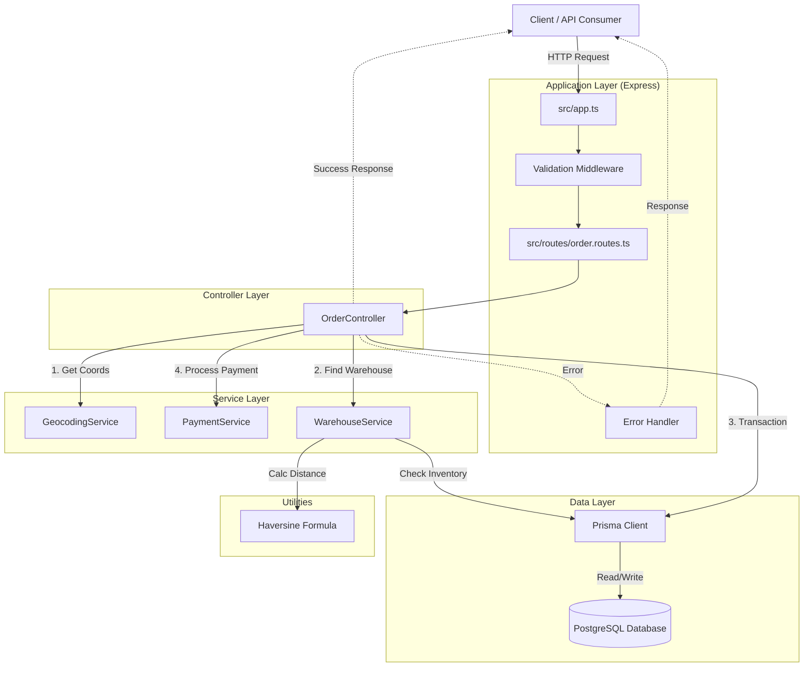

# Canals Assessment - Order Management API

## Overview

This project is a backend service for an e-commerce platform, specifically implementing a minimal order management API. It is built with **Node.js (Express)**, **TypeScript**, and **Prisma ORM** with a **PostgreSQL** database.

The core functionality includes:
- Creating orders with validation.
- Intelligent warehouse selection (closest warehouse with complete inventory).
- Atomic inventory management and order creation.
- External service integration (Geocoding and Payment mocks).

## Architecture

The application follows a layered architecture (Controller-Service-Repository) to separate concerns and ensure maintainability.

### High-Level Design



### Key Components

1.  **Controllers (`src/controllers`)**: Handle incoming HTTP requests, orchestrate business logic by calling services, and return responses.
    *   `OrderController`: The main entry point for order creation. It manages the flow of geocoding -> warehouse selection -> transaction -> payment.

2.  **Services (`src/services`)**: Encapsulate specific business logic and external integrations.
    *   `WarehouseService`: Responsible for finding the best warehouse. It filters warehouses by inventory availability and then sorts by distance using the Haversine formula.
    *   `GeocodingService`: Mocks the conversion of an address to coordinates.
    *   `PaymentService`: Mocks payment processing.

3.  **Data Layer (`prisma/`)**:
    *   Uses **Prisma** as the ORM / Query Builder.
    *   **PostgreSQL** is the underlying database.
    *   `schema.prisma` defines the models (`Order`, `Product`, `Warehouse`, `Inventory`, `OrderItem`).

4.  **Middleware (`src/middlewares`)**:
    *   `validation.middleware`: Uses **Zod** to strictly validate request bodies before they reach the controller.
    *   `error-handler.middleware`: Centralized error handling to ensure consistent JSON error responses.

## Database Schema

The data model focuses on strict relational integrity:

*   **Product**: Catalog items (SKU, name, price).
*   **Warehouse**: Physical locations (Latitude, Longitude).
*   **Inventory**: Link table between Warehouse and Product with quantity tracking.
*   **Order**: Customer orders (status: PENDING -> PAID/FAILED).
*   **OrderItem**: Snapshot of items in an order (price at purchase, quantity).

## Getting Started

### Prerequisites

*   Node.js (v18+)
*   pnpm (or npm/yarn)
*   Docker & Docker Compose (for the database)

### Installation

1.  Clone the repository.
2.  Install dependencies:
    ```bash
    pnpm install
    ```
3.  Set up environment variables:
    ```bash
    cp .env.example .env
    ```

### Running the Database

Use Docker Compose to spin up a PostgreSQL instance:

```bash
docker-compose up -d
```

### Database Migration & Seeding

Run the Prisma migrations to create tables and seed the database with initial test data (Products, Warehouses, Inventory):

```bash
pnpm prisma migrate dev
# The seed script runs automatically after migration
```

### Running the Application

Start the development server:

```bash
pnpm dev
```

The server will start on `http://localhost:3000`.

### Running Tests

The project includes a comprehensive suite of unit and integration tests using **Jest** and **Supertest**.

```bash
pnpm test
```

## API Reference

### Create Order

**Endpoint:** `POST /orders`

**Request Body:**

```json
{
  "customer": {
    "email": "danny@example.com"
  },
  "address": "123 Broadway, New York, NY",
  "paymentDetails": {
    "creditCard": "4111111111111111"
  },
  "items": [
    {
      "productId": "uuid-of-product",
      "quantity": 2
    }
  ]
}
```

**Success Response (201 Created):**

```json
{
  "id": "order-uuid",
  "status": "PAID",
  "totalAmount": 2000,
  "warehouse": {
    "id": "warehouse-uuid",
    "name": "Manhattan Warehouse"
  },
  "orderItems": [...]
}
```

## Design Decisions & Trade-offs

1.  **Strict Inventory Checks**:
    *   **Decision**: The application enforces that a single warehouse must fulfill the *entire* order.
    *   **Trade-off**: This simplifies logistics but might result in lost sales if stock is split across locations. A "Split Shipment" feature would be the next logical upgrade.

2.  **Atomic Transactions**:
    *   **Decision**: Uses `prisma.$transaction` to ensure that Inventory Deduction and Order Creation happen atomically.
    *   **Why**: To prevent race conditions where two users buy the last item simultaneously (Over-selling).

3.  **Payment Flow**:
    *   **Decision**: Payment is processed *after* the database transaction commits (Order is created as PENDING), but before the response is sent.
    *   **Why**: We don't want to hold a database lock while waiting for a 3rd party payment API. If payment fails, the user is informed, and the order stays PENDING (or can be marked FAILED).
    *   **Current Logic**: If payment fails, the API returns a 402 error, but the Order record remains in the DB as PENDING.

5.  **Warehouse Search (Scalability Trade-off)**:
    *   **Current Approach**: The `WarehouseService` fetches warehouses and filters them in-memory. This is chosen for simplicity and portability (no specialized DB extensions required for the assessment).
    *   **Production Scaling**: For a high-traffic system with thousands of warehouses, this logic should move to the database. We would utilize **PostGIS** to calculate `ST_Distance` and filter inventory in a single efficient SQL query.

6.  **Mock Services**:
    *   `GeocodingService` and `PaymentService` are interfaces. In a real production environment, these classes would be swapped for implementations calling Google Maps API or Stripe/Square APIs.

7.  **Validation**:
    *   Used **Zod** for runtime request validation. This ensures the controller only ever deals with valid, typed data.

## Future Improvements

*   **Authentication**: Add JWT-based auth for customers.
*   **Split Shipments**: Allow fulfilling orders from multiple warehouses.
*   **Async Processing**: Move payment processing to a background job queue (e.g., BullMQ) for better resilience.
*   **Idempotency**: Add idempotency keys to the Order endpoint to prevent duplicate orders on network retries.
