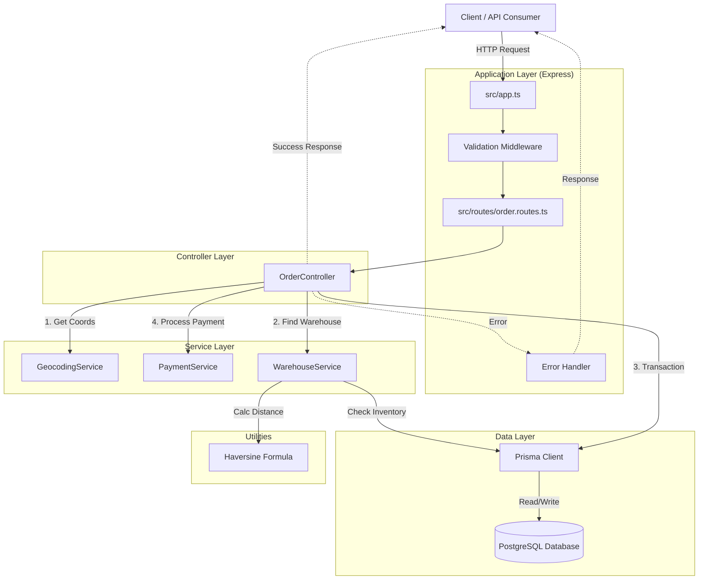

# Canals Assessment - Order Management System

Welcome to the Canals Order Management System! This project is a backend assessment implementing a robust, production-ready Order API with intelligent warehouse selection, inventory management, and external service integration.

## 🚀 Quick Start (Reviewer Track)

**One command to rule them all!** Just run:

```bash
docker compose up
```

This single command will:
1.  **Start PostgreSQL** database on port 5432
2.  **Run migrations** automatically to create the schema
3.  **Seed the database** with 5 products, 3 warehouses, and inventory data
4.  **Start the API server** on `http://localhost:3000`

**That's it!** The application is ready to use. No additional setup required.

### Verifying the Setup

Once the containers are running (you'll see "Server is running on port 3000" in the logs), verify everything works:

**Option 1: Quick API Check**
```bash
# Check health
curl http://localhost:3000/health

# List products (should return 5 products)
curl http://localhost:3000/products

# List warehouses (should return 3 warehouses)
curl http://localhost:3000/warehouses
```

**Option 2: Interactive CLI** (requires local dependencies)
```bash
# In a new terminal, install dependencies first
pnpm install

# Run the interactive CLI
pnpm cli
```

---

## 🛠️ Tech Stack

*   **Runtime:** Node.js (v18+)
*   **Framework:** Express.js
*   **Language:** TypeScript
*   **Database:** PostgreSQL
*   **ORM:** Prisma
*   **Validation:** Zod
*   **Testing:** Jest & Supertest
*   **Infrastructure:** Docker & Docker Compose

## 🏗️ Architecture

The application follows a **Controller-Service-Repository** pattern to ensure separation of concerns and testability.

### High-Level Design



### Core Components

1.  **Controllers (`src/controllers`)**: Handle HTTP requests, input validation (via Zod middleware), and response formatting.
2.  **Services (`src/services`)**: Contain business logic.
    *   **`OrderService`**: Orchestrates order creation.
    *   **`WarehouseService`**: Implements the "closest warehouse with complete inventory" algorithm.
    *   **`GeocodingService`**: Mocks address-to-coordinate conversion.
    *   **`PaymentService`**: Mocks external payment processing.
3.  **Data Layer (`prisma/`)**: Manages database interactions using Prisma Client.

### Key Design Decisions

*   **Atomic Transactions**: Inventory deduction and order creation happen within a `prisma.$transaction`. This ensures consistency—we never create an order without successfully reserving stock.
*   **Strict Inventory Check**: An order is only fulfilled if a *single* warehouse can provide all items. This simplifies the MVP but mirrors real-world constraints for specific shipping classes.
*   **Payment Flow**: Payment is processed *after* the database transaction commits the order as `PENDING`. If payment fails, the user gets an error, and the order remains `PENDING` (safe state) rather than rolling back the entire database record, allowing for retry logic or audit trails.
*   **Haversine Formula**: Used to calculate the great-circle distance between the customer and warehouses to minimize shipping costs/time.

---

## 🖥️ Interactive CLI

The project includes a custom CLI tool to make manual testing effortless.

**Command:** `pnpm cli`

**Features:**
*   fetches and displays available **Products**.
*   Walks you through building an **Order** (selecting items, quantities).
*   Lets you choose from **Pre-defined Addresses** (mapped to different regions to test warehouse selection).
*   Displays **Live Inventory** status from warehouses.
*   Generates and executes the corresponding `curl` command.
*   Shows the raw JSON response.

---

## 📡 API Reference

### 1. Get Products
Returns the catalog of available items.

*   **Endpoint:** `GET /products`
*   **Response:**
    ```json
    [
      { "id": "uuid...", "name": "Laptop", "price": 129999, "sku": "PROD-001" }
    ]
    ```

### 2. Create Order
Creates a new order, validates stock, and processes payment.

*   **Endpoint:** `POST /orders`
*   **Body:**
    ```json
    {
      "customer": { "email": "test@canals.ai" },
      "address": "123 Main St, New York, NY",
      "paymentDetails": { "creditCard": "4111111111111111" },
      "items": [
        { "productId": "uuid...", "quantity": 1 }
      ]
    }
    ```
*   **Response (201 Created):**
    ```json
    {
      "id": "order-uuid",
      "status": "PAID",
      "warehouse": { "name": "East Coast Warehouse" },
      "totalAmount": 129999
    }
    ```

---

## 🧪 Testing

The project includes focused Integration and Unit tests covering critical business logic.

### Running Tests Locally

```bash
# Run all tests
pnpm test

# Run tests with coverage report
pnpm test:coverage
```

### Running Tests in Docker

To run the Jest test suite inside the Docker container:

```bash
# First, ensure the containers are running
docker compose up -d

# Run all tests inside the app container
docker compose exec app pnpm test

# Run tests with coverage
docker compose exec app pnpm test:coverage

# Run tests in watch mode (useful for development)
docker compose exec app pnpm test:watch
```

Alternatively, run tests as a one-off command (starts a new container):

```bash
docker compose run --rm app pnpm test
```

### Coverage Highlights
*   **Warehouse Selection:** Verifies that the closest warehouse with *all* items is chosen.
*   **Concurrency:** Tests that inventory is not oversold during simultaneous requests.
*   **Error Handling:** Validates behavior when payment fails or inventory is insufficient.

---

## 📂 Project Structure

```
.
├── cli/                # Interactive CLI tool source code
├── prisma/             # Database schema, migrations, and seed script
├── src/
│   ├── config/         # App configuration (env vars, DB connection)
│   ├── controllers/    # Request handlers
│   ├── middlewares/    # Error handling & Validation (Zod)
│   ├── routes/         # Express route definitions
│   ├── services/       # Business logic (Geocoding, Payment, Warehouse)
│   └── types/          # TypeScript type definitions
├── tests/              # Jest test suite (Integration & Unit)
└── docker-compose.yml  # Container orchestration
```

## 🔧 Manual Setup (Local Dev)

If you prefer running without Docker Compose for the app:

1.  **Start Postgres:**
    ```bash
    docker-compose up -d postgres
    ```
2.  **Configure Env:**
    Copy `.env.example` to `.env` (defaults are set for local Docker Postgres).
3.  **Install Deps:**
    ```bash
    pnpm install
    ```
4.  **Migrate & Seed:**
    ```bash
    pnpm prisma migrate dev
    ```
5.  **Start Server:**
    ```bash
    pnpm dev
    ```

## 🐛 Troubleshooting

*   **"No products available" in CLI:** Ensure you ran migrations/seeding (`pnpm prisma:migrate` or restart the Docker container).
*   **Database connection refused:** Ensure the `postgres` container is healthy (`docker ps`) and your `.env` `DATABASE_URL` matches the exposed port.