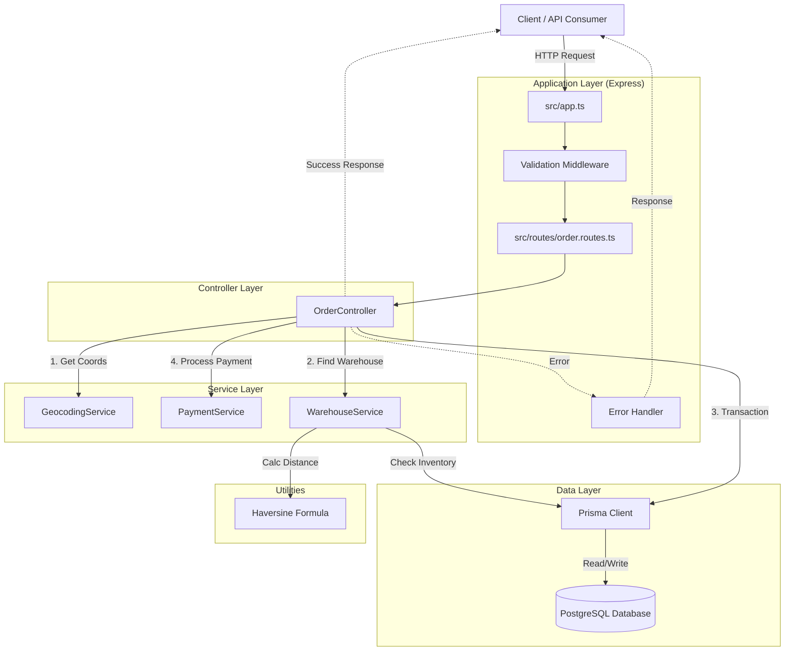

# Canals Assessment - Order Management System

## Table of Contents

1. [Quick Start](#quick-start)
2. [Executive Overview](#executive-overview)
3. [Architectural Philosophy](#architectural-philosophy)
4. [System Architecture](#system-architecture)
5. [Core Design Decisions](#core-design-decisions)
6. [Data Layer Design](#data-layer-design)
7. [Business Logic Implementation](#business-logic-implementation)
8. [Error Handling Strategy](#error-handling-strategy)
9. [Testing Philosophy](#testing-philosophy)
10. [Developer Experience Tooling](#developer-experience-tooling)
11. [API Reference](#api-reference)
12. [Known Limitations & Production Considerations](#known-limitations--production-considerations)
13. [Project Structure](#project-structure)
14. [Troubleshooting](#troubleshooting)

---

## Quick Start

### One Command Setup (Reviewer Track)

```bash
docker compose up
```

This single command will:

1. **Start PostgreSQL** database on port 5432
2. **Run migrations** automatically to create the schema
3. **Seed the database** with 5 products, 3 warehouses, and inventory data
4. **Start the API server** on `http://localhost:3000`

**That's it!** The application is ready to use. No additional setup required.

### Verifying the Setup

Once the containers are running (you'll see "Server is running on port 3000" in the logs):

```bash
# Check health
curl http://localhost:3000/health

# List products (should return 5 products)
curl http://localhost:3000/products

# List warehouses (should return 3 warehouses)
curl http://localhost:3000/warehouses
```

### Interactive CLI (requires local dependencies)

```bash
# In a new terminal, install dependencies first
pnpm install

# Run the interactive CLI
pnpm cli
```

### Running Tests

```bash
# Run all tests locally
pnpm test

# Run tests with coverage report
pnpm test:coverage

# Run tests inside Docker
docker compose exec app pnpm test
```

### Tech Stack

| Category       | Technology              |
|----------------|-------------------------|
| Runtime        | Node.js (v18+)          |
| Framework      | Express.js              |
| Language       | TypeScript (strict)     |
| Database       | PostgreSQL              |
| ORM            | Prisma                  |
| Validation     | Zod                     |
| Testing        | Jest & Supertest        |
| Infrastructure | Docker & Docker Compose |

---

## Executive Overview

This document provides a comprehensive technical analysis of the Order Management System, detailing the architectural patterns, design decisions, and implementation strategies employed. The system was built with production readiness as the primary goal, meaning every technical choice was made with considerations for scalability, maintainability, data integrity, and operational excellence in mind.

The assessment requirements were intentionally minimal, providing only the core business logic needed for order creation. However, I interpreted "production-ready" to mean the code should be deployable to a high-traffic environment without significant refactoring. This interpretation guided decisions around transaction safety, error handling, testing coverage, and operational tooling.

The core philosophy behind this implementation was to treat the assessment not just as a coding challenge, but as a system design simulation. While the prompt relaxed requirements around testing and full-system implementation, I chose to include components (CLI, Tests, Docker) that I believe are non-negotiable for a truly "production-ready" codebase.

### What This System Does

- `POST /orders` creates an order for a customer shipping to an address with a list of line items (product + quantity)
- An order must be fulfilled by exactly one warehouse, selected as:
  1. Any warehouse that can supply **all requested SKUs** in the requested quantities
  2. Among those, the warehouse **closest** to the shipping address
- Address-to-coordinates conversion is handled via a geocoding service interface (mocked for assessment)
- Payment authorization is handled via a payment gateway interface (mocked for assessment)
- Data is persisted in PostgreSQL via Prisma with full transactional integrity

---

## Architectural Philosophy

### Layered Architecture as Foundation

The system follows a strict layered architecture pattern, commonly known as the **Controller-Service-Repository** pattern. This architectural style emerged from decades of experience building enterprise systems and has proven particularly effective for business-critical applications where correctness and maintainability matter more than bleeding-edge architectural experimentation.



The architecture consists of three primary layers, each with distinct responsibilities:

**Controller Layer** (`src/controllers`): Handles HTTP concerns - parsing requests, validating input schemas, and formatting responses. Critically, controllers know nothing about business logic. They simply orchestrate the flow of data between the HTTP world and the domain model. Think of the controller as a conductor - it knows when each section of the orchestra should play but doesn't play any instruments itself.

**Service Layer** (`src/services`): Contains all business logic, from warehouse selection algorithms to payment processing workflows. Services operate on domain objects and have no knowledge of HTTP or databases.

- **`OrderService`**: The main orchestrator managing order lifecycle
- **`WarehouseService`**: Encapsulates the "Closest Warehouse" algorithm
- **`PaymentService`** & **`GeocodingService`**: Implemented as interfaces (`IPaymentService`, `IGeocodingService`) to allow for easy mocking and provider swapping

**Data Access Layer** (`prisma`): Uses Prisma ORM for type-safe database interactions. The schema ensures data integrity through foreign keys and unique constraints (e.g., composite unique key on `Inventory` for `warehouseId_productId`).

This separation creates natural boundaries that make the system easier to reason about. When debugging a production issue, these boundaries tell you exactly where to look:

- If data is corrupted, the problem is in the Repository layer
- If business logic is wrong, it's in the Service layer
- If the API returns malformed responses, it's in the Controller layer

### Dependency Injection and Interface-Based Design

Throughout the codebase, you'll notice extensive use of TypeScript interfaces for service definitions. The geocoding service, payment service, and warehouse service all implement interfaces rather than being concrete classes that are directly instantiated. This design reflects the **dependency inversion principle**: high-level modules should not depend on low-level modules; both should depend on abstractions.

The practical benefit becomes obvious when you consider testing and future integration work. The `OrderService` doesn't know or care whether it's talking to a mock geocoding service or the Google Maps API. It simply knows it can call a `geocode` method and receive coordinates. This allows us to:

- Test order creation logic without making actual API calls
- Speed up test execution
- Swap implementations trivially when integrating real services
- Prevent vendor lock-in (switch from Google Maps to Mapbox without touching order logic)

---

## System Architecture

### Request Flow: Order Creation

Understanding how a request flows through the system illuminates the architectural choices:

1. **Input Validation**: When a POST request arrives at `/orders`, it first encounters Zod validation middleware. Invalid requests are rejected immediately with detailed error messages, preventing malformed data from ever reaching business logic.

2. **Geocoding**: The controller geocodes the shipping address, converting "123 Main St, New York, NY" into latitude/longitude coordinates essential for distance calculations.

3. **Warehouse Selection**: The `WarehouseService` executes a sophisticated algorithm:
   - Query all warehouses from the database
   - Filter to only those with sufficient inventory for all requested items
   - Calculate distance to each using the Haversine formula
   - Select the closest warehouse that can fulfill the complete order

4. **Payment Processing**: The payment service simulates calling an external payment gateway, returning a transaction ID upon success.

5. **Atomic Persistence**: Only after payment succeeds does the controller initiate the database transaction that reserves inventory and creates the order record. Inside the transaction, inventory levels are re-checked with row-level locks to prevent race conditions.

6. **Response**: A detailed response includes order details plus warehouse selection metadata explaining why a particular warehouse was chosen.

### Data Flow & Transaction Strategy (The Saga Pattern)

A critical architectural decision was how to handle the distributed transaction between the internal database (Inventory/Order) and the external Payment API:

1. **Preparation**: Validate inputs and calculate totals
2. **External Action**: Process payment *before* opening a database transaction
   - *Why?* Database transactions hold locks. Waiting for a potentially slow external Payment API while holding row locks on Inventory tables would kill concurrency and performance
3. **Atomic Commit**: Once payment succeeds, open a `prisma.$transaction` to deduct inventory and create the order record
4. **Compensation**: If the database transaction fails (e.g., race condition on inventory), the `catch` block triggers a **refund** via the `PaymentService`

This approach trades simplicity for correctness. By processing payment first, we fail fast if payment issues exist. The customer gets immediate feedback without leaving artifacts in our database.

---

## Core Design Decisions

### Why Strict Type Safety Throughout

The entire codebase uses TypeScript in strict mode, with compiler options that enforce the highest level of type safety. This prevents entire categories of bugs:

- TypeScript's strict mode catches null pointer exceptions, type coercion issues, and property access errors at compile time
- Prisma generates TypeScript types from the database schema, ensuring queries are validated at compile time
- Zod extends type safety to runtime data, with validated data typed using TypeScript's inference

### Why Database Transactions with Re-validation

The decision to use database transactions with re-validation addresses a subtle but critical race condition:

Imagine two customers simultaneously placing orders for the last unit of a product. Both requests check inventory and see one unit available. Both proceed to create orders. Without proper transaction handling, both orders would succeed, and we'd have oversold our inventory.

The solution uses Postgres row-level locking within transactions:

1. When the transaction begins, it re-checks inventory levels and locks the inventory rows
2. If another transaction has already locked those rows, this transaction waits
3. When the first transaction commits and releases its locks, the second transaction acquires the locks but discovers insufficient inventory
4. It then rolls back, preventing the oversell

This pattern is called **"optimistic concurrency control with validation"** - we optimistically assume inventory will be available, but validate pessimistically inside the transaction with locks.

### Why Payment Before Database Commit

The order of operations might seem counterintuitive. Why process payment before creating the order in the database?

If we created the order first and payment failed, we'd have an order record with a PENDING payment status. We'd need background jobs to clean up failed orders, retry payments, or notify customers. The system becomes more complex with multiple possible states.

By processing payment first:

- We fail fast if payment issues exist
- The customer gets immediate feedback that their payment was declined
- The happy path is simpler: payment succeeds, then we create the order
- The only failure scenario we handle is payment succeeding but database transaction failing, which triggers compensation (refund) logic

### Why Mock Services with Real Interfaces

The geocoding and payment services are implemented as mocks but implement production-ready interfaces. This approach:

- Allows development and testing without external dependencies or API keys
- Provides fast, deterministic behavior for testing
- Establishes the contract that real implementations must follow
- Enables progressive rollout (deploy with mocks, verify logic works, swap in real services)

---

## Data Layer Design

### Database Schema Philosophy

The schema follows principles of normalization and referential integrity:

- Products, warehouses, and inventory are modeled as separate entities with explicit relationships
- OrderItems store `priceAtPurchase` rather than referencing current product price (critical for historical accuracy)
- Cascade and restrict behaviors on foreign keys are carefully chosen based on business semantics
- The unique constraint on `(warehouseId, productId)` in inventory prevents duplicate entries and is enforced at the database level

### Why Prisma as ORM

Prisma was chosen over traditional ORMs for several reasons:

- **Type Generation**: Prisma generates TypeScript types from the schema, eliminating drift between database and TypeScript types
- **Type-Safe Queries**: Compile-time validation catches non-existent column references
- **Reliable Migrations**: Stored as SQL files that can be reviewed and version controlled
- **Transaction API**: Provides both managed transactions and interactive transactions for complex logic like our re-validation pattern

### Inventory Management Strategy

The inventory model is where transaction safety matters most:

- Each inventory record represents a quantity of a specific product at a specific warehouse
- Orders decrement inventory using Prisma's atomic decrement operation within a transaction
- The re-validation pattern inside the transaction prevents overselling
- The database's ACID properties guarantee no other transaction can modify inventory between validation and decrement

---

## Business Logic Implementation

### Warehouse Selection Algorithm

The requirement is to select a warehouse that can fulfill the entire order and is closest to the customer:

1. **Geocode the shipping address** to obtain latitude/longitude coordinates
2. **Calculate distances** using the Haversine formula (accounts for Earth's curvature, unlike Euclidean distance)
3. **Filter warehouses** to only those with sufficient inventory for all items (single warehouse fulfillment requirement)
4. **Sort by distance** and select the closest

The Haversine implementation converts latitude/longitude from degrees to radians, applies spherical trigonometry to calculate angular distance, and multiplies by Earth's radius to get distance in kilometers.

### Error Cases

- **No warehouse has all items**: Throws `BusinessError` with code `SPLIT_SHIPMENT_NOT_SUPPORTED`
- **Insufficient quantities**: Warehouse is excluded from consideration; error includes details about which products are missing
- **Selection metadata**: Results include distance, selection reason, and information about excluded warehouses for transparency and debugging

### Payment Processing and Compensation

The payment service implements the **compensation pattern**:

1. If payment succeeds but database transaction fails, immediately attempt refund
2. Log as critical because it requires manual verification
3. In production, this would: enqueue a background job with retry logic, integrate with alerting (PagerDuty), store failed transaction details for audit

The payment service also includes a testing hook: amounts of exactly 9999 cents trigger payment failure, allowing integration tests to verify error handling paths.

---

## Error Handling Strategy

### Centralized Error Handler

The error handler middleware distinguishes between error types:

| Error Type | Handling |
|------------|----------|
| `BusinessError` | Expected conditions (insufficient inventory, payment failure) - return appropriate HTTP status and error code |
| `ZodError` | Validation failures - transform to client-friendly format listing which fields failed |
| `PrismaClientKnownRequestError` | Database errors - map codes (P2002 = constraint violation, P2025 = not found) to HTTP status codes |
| All others | Unexpected server errors - hide details in production, show full error in development |

### Custom Error Classes

`BusinessError` extends JavaScript's `Error` class to add:

- HTTP status codes
- Application-specific error codes (`SPLIT_SHIPMENT_NOT_SUPPORTED`, `INSUFFICIENT_INVENTORY`)
- Proper stack trace capture using `Error.captureStackTrace`

The `asyncHandler` wrapper ensures all async errors flow through the centralized error handler (Express doesn't naturally catch errors in async route handlers).

---

## Testing Philosophy

### Why Comprehensive Tests Despite Being Optional

The assessment explicitly stated tests were optional, but I included comprehensive coverage because:

1. **Untested code isn't production-ready** - tests verify correctness, document behavior, prevent regressions, and enable confident refactoring
2. **The highest-risk behavior is concurrency** - inventory oversell bugs are race conditions that are expensive and reputationally damaging
3. **Distributed failure modes exist** - payment can succeed while DB fails; tests validate compensation/refund paths
4. **Test-resistant code is poorly designed** - writing tests validated the service abstractions and dependency injection patterns

### Test Organization

| Type | Purpose | Examples |
|------|---------|----------|
| **Unit Tests** | Individual components in isolation | Haversine distance calculation, warehouse service logic |
| **Integration Tests** | End-to-end verification with real database | Order controller, route tests, transaction behavior |

The test helpers provide factory functions (`createTestProduct`, `createTestWarehouse`) to prevent duplication and improve readability. Global setup/teardown ensures each test runs with a clean database.

### Coverage Focus

Tests focus on critical business logic and error paths:

- Warehouse selection (distance calculation, inventory filtering)
- Order creation (successful flow, insufficient inventory, payment failures)
- Concurrent order scenarios (race condition prevention)
- Validation (fractional quantities, negative quantities, missing fields)

What's notably absent is exhaustive unit testing of trivial functions - testing everything leads to brittle tests that break with every refactor while providing little value.

---

## Developer Experience Tooling

### Interactive CLI

The CLI (`pnpm cli`) was built because good developer experience matters:

- **Eliminates friction**: No need to manually format JSON, remember product IDs, or construct valid requests
- **Self-documenting**: Displays the exact curl command being executed and raw JSON response
- **Demonstrates warehouse selection**: Shows which warehouses were considered, their inventory levels, and why they were chosen or rejected

**Features**:

- Fetches and displays available products
- Walks through building an order (selecting items, quantities)
- Pre-defined addresses mapped to different regions for testing warehouse selection
- Live inventory status display
- Generates and executes corresponding `curl` command
- Shows raw JSON response

The pre-defined addresses aren't random - they're specifically chosen to route to different warehouses (Los Angeles to West Coast, Chicago to Central, New York to East Coast).

### Docker and Development Environment

The Docker Compose setup provides one-command development:

- **Entrypoint script** waits for PostgreSQL, runs migrations, creates test database, includes retry logic
- **Health checks** prevent the application from starting before dependencies are ready
- **Volume mounts** preserve database data between restarts
- **.dockerignore** prevents including node_modules for faster builds

---

## API Reference

### Get Products

Returns the catalog of available items.

- **Endpoint**: `GET /products`
- **Response**:

```json
[
  { "id": "uuid...", "name": "Laptop", "price": 129999, "sku": "PROD-001" }
]
```

### Get Warehouses

Returns available warehouses with their locations.

- **Endpoint**: `GET /warehouses`
- **Response**:

```json
[
  { "id": "uuid...", "name": "East Coast Warehouse", "latitude": 40.7128, "longitude": -74.0060 }
]
```

### Create Order

Creates a new order, validates stock, and processes payment.

- **Endpoint**: `POST /orders`
- **Body**:

```json
{
  "customer": { "email": "test@canals.ai" },
  "address": "123 Main St, New York, NY",
  "paymentDetails": { "creditCard": "4111111111111111" },
  "items": [
    { "productId": "uuid...", "quantity": 1 }
  ]
}
```

- **Response (201 Created)**:

```json
{
  "id": "order-uuid",
  "status": "PAID",
  "warehouse": { "name": "East Coast Warehouse" },
  "totalAmount": 129999
}
```

### Health Check

- **Endpoint**: `GET /health`
- **Response**: `{ "status": "ok" }`

---

## Known Limitations & Production Considerations

### Warehouse Selection Performance at Scale

**Current Implementation**: Queries all warehouses from the database for every order. With three warehouses, this is trivial. With hundreds or thousands, it becomes inefficient.

**Production Solutions**:

- Use PostGIS extension for geospatial queries (query warehouses within radius, ordered by distance)
- Push feasibility filtering into SQL (join/filter on required SKUs + quantities)
- Cache warehouse locations (warehouses don't move frequently)
- Consider precomputing warehouse service regions

### Race Conditions

**Current Implementation**: Small window between payment processing and inventory deduction where another user could claim the last item.

**Production Solutions**:

- Handled via compensation (refund) logic
- Stricter approach: two-phase commit or "Reservation" system where stock is reserved (pending state) before payment

### Console.log vs. Structured Logging

**Current Implementation**: Uses `console.log` for logging.

**Production Solutions**:

- Replace with structured logging (Winston/Pino)
- Include correlation IDs, log levels, JSON formatting for ingestion (Datadog/Splunk)
- Explicit redaction of sensitive values (credit card numbers)
- Critical errors trigger PagerDuty alerts

### Payment Idempotency

**Current Implementation**: No idempotency protection for order creation.

**Production Solutions**:

- Require `Idempotency-Key` header for order creation
- Store idempotency keys in database, return same order for duplicate requests
- Use payment-provider idempotency features (payment intent idempotency)

### Credit Card Handling

**Current Implementation**: Raw card numbers as input (assessment simplification).

**Production Solutions**:

- Never accept raw PANs at this service boundary
- Use client-side tokenization + gateway tokens
- Implement PCI-compliant architecture
- Scrub sensitive data from logs and traces

### Authentication

**Current Implementation**: Open API.

**Production Solutions**:

- JWT-based authentication to secure endpoints
- Associate orders with authenticated User IDs rather than email strings

### Quantity Semantics

**Current Implementation**: Quantity treated as a number, allowing fractional quantities.

**Production Solutions**:

- Enforce `quantity` as an integer in API validation for discrete units (typical retail)
- Alternatively, explicitly support fractional units for weight-based SKUs

### Eventing and Asynchronous Workflows

**Current Implementation**: Synchronous for simplicity.

**Production Solutions**:

- Emit domain events (`OrderCreated`, `PaymentAuthorized`)
- Process payment capture asynchronously
- Integrate shipping/fulfillment services via queues

### Data Privacy and Compliance

**Current Implementation**: Stores customer emails and addresses without encryption or special handling.

**Production Considerations**:

- Data retention policies (anonymize/delete after time period)
- Audit logs for data access
- Support data export (GDPR portability) and deletion (GDPR right to be forgotten)
- Encrypt personal data at rest

---

## Project Structure

```
.
├── cli/                # Interactive CLI tool source code
│   ├── config/         # CLI configuration and defaults
│   ├── prompts/        # Interactive prompts (customer, payment, product)
│   ├── services/       # API service wrapper
│   ├── types/          # CLI-specific types
│   └── ui/             # Output formatting
├── prisma/             # Database schema, migrations, and seed script
│   ├── schema.prisma   # Database schema definition
│   └── seed.ts         # Database seeding script
├── src/
│   ├── config/         # App configuration (env vars, DB connection)
│   ├── controllers/    # Request handlers
│   ├── middlewares/    # Error handling & Validation (Zod)
│   ├── routes/         # Express route definitions
│   ├── services/       # Business logic (Geocoding, Payment, Warehouse)
│   ├── types/          # TypeScript type definitions
│   └── utils/          # Utility functions (Haversine)
├── tests/              # Jest test suite
│   ├── helpers/        # Test utilities and factories
│   ├── integration/    # Integration tests
│   └── unit/           # Unit tests
├── docker-compose.yml  # Container orchestration
└── Dockerfile          # Application container definition
```

---

## Manual Setup (Local Development)

If you prefer running without Docker Compose for the app:

1. **Start Postgres**:

   ```bash
   docker compose up -d postgres
   ```

2. **Configure Environment**:
   Copy `.env.example` to `.env` (defaults are set for local Docker Postgres)

3. **Install Dependencies**:

   ```bash
   pnpm install
   ```

4. **Migrate & Seed**:

   ```bash
   pnpm prisma migrate dev
   ```

5. **Start Server**:

   ```bash
   pnpm dev
   ```

---

## Troubleshooting

| Problem | Solution |
|---------|----------|
| "No products available" in CLI | Ensure migrations/seeding ran (`pnpm prisma migrate dev` or restart Docker container) |
| Database connection refused | Ensure `postgres` container is healthy (`docker ps`) and `.env` `DATABASE_URL` matches exposed port |
| Tests failing with database errors | Ensure test database exists (`canals_test`); Docker entrypoint creates it automatically |
| Port 3000 already in use | Stop other services using port 3000 or change `PORT` in `.env` |

---

## Summary of Design Intent

This implementation prioritizes:

- **Correctness under concurrency** (transactions with re-validation)
- **Clean dependency boundaries** (mockable payment/geocoding interfaces)
- **Production-like operational practices** (Docker, migrations, seed)
- **Reviewer usability** (CLI, comprehensive documentation)
- **Targeted tests** validating the riskiest behavior

Where tradeoffs were made, they were made consciously and documented above, with clear upgrade paths for a production system.
